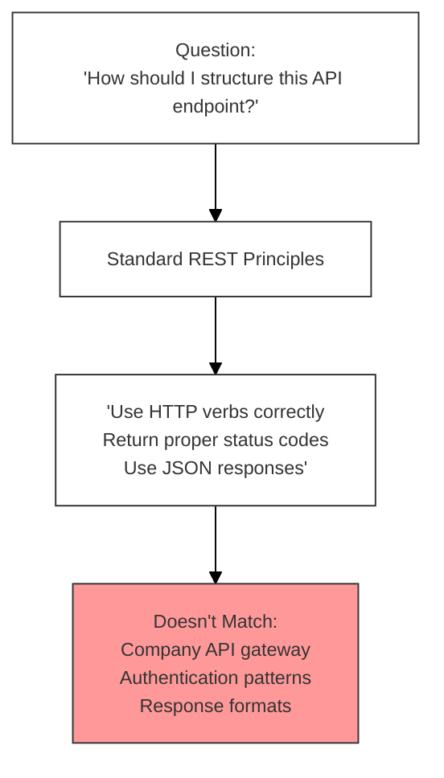
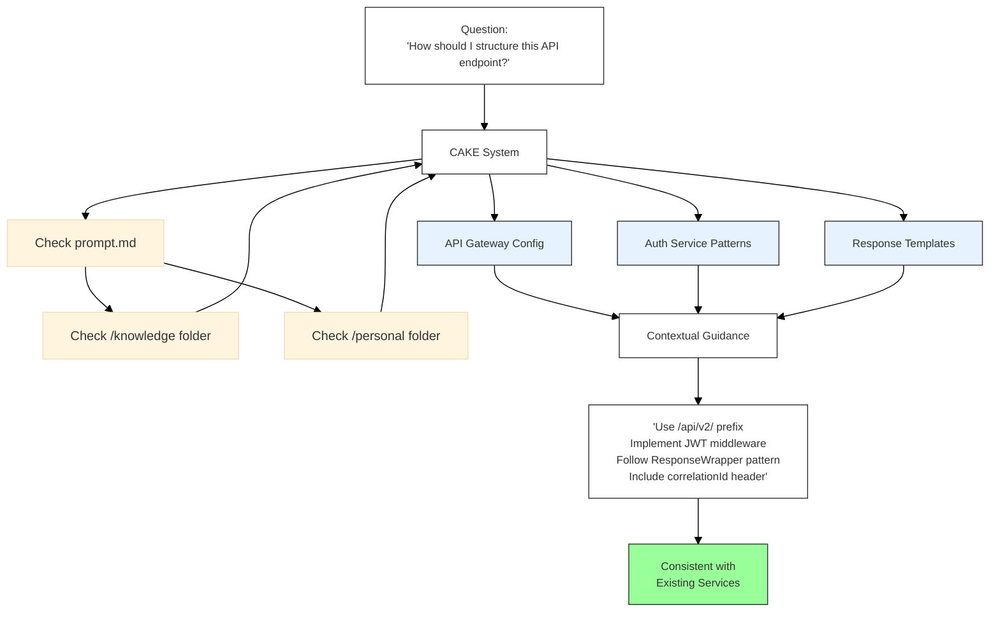

# CAKE (Context-Aware Knowledge Enhancement)

A GitHub template repository designed to enhance AI assistant interactions with context-aware prompts and organized knowledge management for development teams.

## Overview

This template addresses common limitations of pre-trained language models in enterprise environments, including outdated training data and lack of domain-specific knowledge such as company acronyms, team terminology, and project-specific context.

### Without CAKE - Generic Responses




### With CAKE - Context-Aware Responses



**Inspired by Burke Holland's prompt engineering work**: https://gist.github.com/burkeholland

## Repository Structure

### 0. Project Repositories (`repos/`)
Add your Git repositories here to provide code context to AI assistants. For multi-repository services (e.g., `service-api` and `service-frontend`), organize them under a common folder structure. This enables AI agents to interactively navigate and understand the broader project context.

**Example structure:**
```
repos/
├── service_1/
├── service_2-mobile/
├── service_3-api/
├── service_4-backend/
├── raw/
│   ├── architecture/
│   │   ├── design-docs/
│   │   └── system-diagrams/
│   ├── meetings/
│   │   └── team-notes/
│   └── specifications/
│       ├── technical-specs/
│       └── requirements/
├── knowledge/
│   ├── company/
│   │   ├── acronyms.md
│   │   └── terminology.md
│   ├── processes/
│   │   └── workflows.md
│   └── standards/
│       └── guidelines.md
└── personal/
    ├── daily/
    │   └── YYYY-MM-DD.md
    ├── learning/
    │   └── til.md
    └── tasks/
        └── in-progress.md
```

### 1. Raw Knowledge (`raw/`)
Store unprocessed documentation in Markdown (`.md`) or text (`.txt`) format. This serves as a knowledge dump for:
- Project design documents
- Team meeting notes
- Technical specifications
- Architecture decisions
- Requirements documents

**Purpose**: Central repository for all project-related documentation that needs to be processed into structured knowledge.

### 2. Processed Knowledge (`knowledge/`)
AI-curated and organized information extracted from the `raw/` folder. This folder contains:
- **Company-specific terminology** and acronyms
- **Team processes** and workflows  
- **Project context** and domain knowledge
- **Technical standards** and guidelines

**Workflow**: Use your preferred LLM (e.g., Claude Sonnet 4.0) with the provided `prompt.md` instructions to automatically process raw documents into structured knowledge. The AI will read the `raw/` folder contents and create organized, searchable knowledge files.

### 3. Personal Workspace (`personal/`) *[Optional]*
Track individual work progress and maintain context continuity:
- **Daily summaries** of completed tasks
- **Work-in-progress** tracking
- **Technical learnings** (TIL - Today I Learned)
- **Task continuation** notes for next-day pickup

**Benefits**: 
- Reduces context switching overhead
- Provides performance boost for similar/repeated work
- Maintains historical context for decision-making
- Enables better task prioritization and planning

## Usage Workflow

1. **Initialize**: Clone this template and populate the `repos/` folder with your project repositories
2. **Collect**: Add all relevant documentation to the `raw/` folder
3. **Process**: Use AI to transform raw documents into structured knowledge using the provided prompts
4. **Maintain**: Regularly update both raw and processed knowledge as projects evolve
5. **Personalize**: Optionally use the `personal/` folder for individual productivity tracking

## Benefits

- **Enhanced Context**: AI assistants gain deep understanding of your specific projects and terminology
- **Reduced Onboarding**: New team members can quickly understand project context
- **Improved AI Responses**: More accurate and relevant assistance tailored to your environment
- **Knowledge Preservation**: Centralized documentation that evolves with your projects
- **Productivity Gains**: Faster development cycles through better context awareness

## Getting Started

1. Use this template to create a new repository
2. Add your project repositories to the `repos/` folder
3. Populate the `raw/` folder with existing documentation
4. Configure your AI assistant to use the processed knowledge for enhanced interactions

## Contributing

This template is designed to be adapted to your team's specific needs. Feel free to modify the folder structure and processes to match your workflow and organizational requirements.
