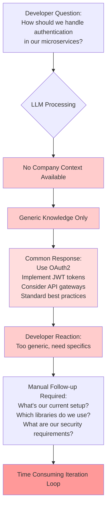
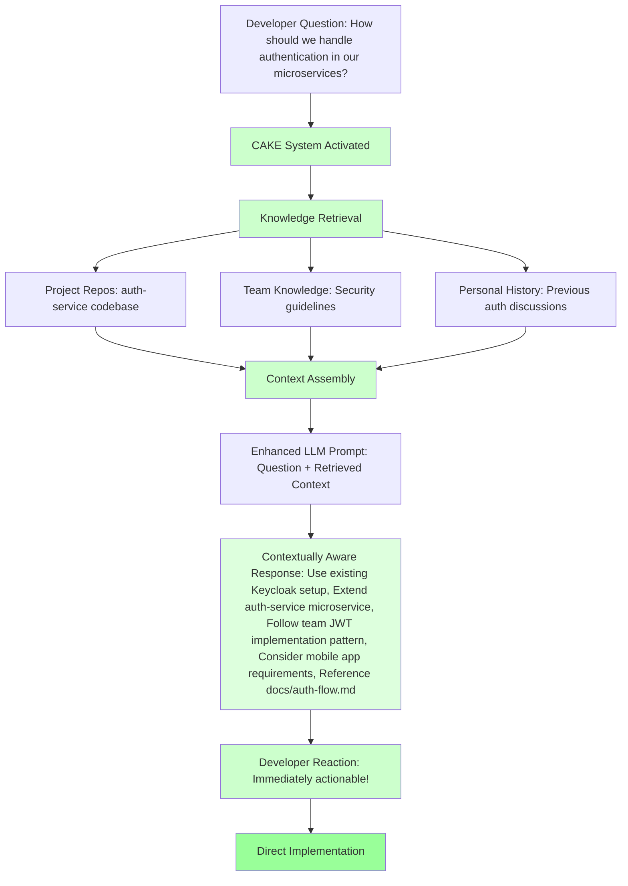

# CAKE (Context-Aware Knowledge Enhancement)

A GitHub template repository designed to enhance AI assistant interactions with context-aware prompts and organized knowledge management for development teams.

## Overview

This template addresses common limitations of pre-trained language models in enterprise environments, including outdated training data and lack of domain-specific knowledge such as company acronyms, team terminology, and project-specific context.

**The Problem CAKE Solves:**
Without organized context, AI assistants provide generic responses that require manual clarification and context addition, leading to time-consuming iterations and suboptimal results. CAKE transforms this workflow by providing structured, immediately accessible context that enables AI assistants to deliver contextually aware, relevant responses from the first interaction.

## Workflow Comparison: Without CAKE vs With CAKE

[15]

**Inspired by Burke Holland's prompt engineering work**: https://gist.github.com/burkeholland

## Repository Structure

### 0. Project Repositories (`repos/`)
Add your Git repositories here to provide code context to AI assistants. For multi-repository services (e.g., `service-api` and `service-frontend`), organize them under a common folder structure. This enables AI agents to interactively navigate and understand the broader project context.

**Example structure:**
```
repos/
├── service_1/
│   ├── service-api/
│   └── service-frontend/
└── service_2/
    ├── backend/
    └── mobile-app/
```

### 1. Raw Knowledge (`raw/`)
Store unprocessed documentation in Markdown (`.md`) or text (`.txt`) format. This serves as a knowledge dump for:
- Project design documents
- Team meeting notes  
- Technical specifications
- Architecture decisions
- Requirements documents

**Purpose**: Central repository for all project-related documentation that needs to be processed into structured knowledge.

### 2. Processed Knowledge (`knowledge/`)
AI-curated and organized information extracted from the `raw/` folder. This folder contains:
- **Company-specific terminology** and acronyms
- **Team processes** and workflows  
- **Project context** and domain knowledge
- **Technical standards** and guidelines

**Workflow**: Use your preferred LLM (e.g., Claude Sonnet 4.0) with the provided `prompt.md` instructions to automatically process raw documents into structured knowledge. The AI will read the `raw/` folder contents and create organized, searchable knowledge files.

### 3. Personal Workspace (`personal/`) *[Optional]*
Track individual work progress and maintain context continuity:
- **Daily summaries** of completed tasks
- **Work-in-progress** tracking
- **Technical learnings** (TIL - Today I Learned)
- **Task continuation** notes for next-day pickup

**Benefits**: 
- Reduces context switching overhead
- Provides performance boost for similar/repeated work
- Maintains historical context for decision-making
- Enables better task prioritization and planning

## Usage Workflow

1. **Initialize**: Clone this template and populate the `repos/` folder with your project repositories
2. **Collect**: Add all relevant documentation to the `raw/` folder
3. **Process**: Use AI to transform raw documents into structured knowledge using the provided prompts
4. **Maintain**: Regularly update both raw and processed knowledge as projects evolve
5. **Personalize**: Optionally use the `personal/` folder for individual productivity tracking

## Key Benefits

### **Enhanced Context Awareness**
AI assistants gain deep understanding of your specific projects, terminology, and workflows, eliminating the need for repetitive context explanations.

### **Accelerated Development Cycles**  
Reduce time spent on clarifications and context-setting by providing immediate access to relevant project knowledge and team-specific information.

### **Improved Response Quality**
Receive more accurate, relevant, and actionable responses tailored to your specific environment and requirements from the first interaction.

### **Streamlined Team Onboarding**
New team members can quickly understand project context and terminology through organized, AI-processable documentation.

### **Knowledge Preservation & Evolution**
Maintain centralized documentation that evolves with your projects, ensuring institutional knowledge is captured and accessible.

### **Reduced Cognitive Load**
Minimize context switching and mental overhead by maintaining persistent, organized context for all project-related AI interactions.

## Technical Implementation

**Mermaid Diagram Support**: The repository structure supports visual workflow documentation using Mermaid syntax, enabling clear representation of processes and decision flows directly in Markdown files.

**AI Processing Pipeline**: Raw documentation is systematically transformed into structured knowledge using consistent prompts and AI processing workflows, ensuring quality and consistency across knowledge extraction.

**Version Control Integration**: All knowledge artifacts are version-controlled, allowing teams to track the evolution of their understanding and maintain historical context.

## Getting Started

1. **Use this template** to create a new repository for your team
2. **Populate `repos/`** with your project repositories  
3. **Add documentation** to the `raw/` folder
4. **Process with AI** using the provided prompt templates
5. **Configure your AI assistant** to reference the structured knowledge for enhanced interactions

## Advanced Usage

### Custom Knowledge Categories
Extend the `knowledge/` structure with domain-specific categories relevant to your team:
- `architecture/` - System design patterns and decisions  
- `apis/` - Endpoint documentation and integration guides
- `deployment/` - Infrastructure and deployment procedures
- `troubleshooting/` - Common issues and resolution patterns

### Integration with Development Tools
- **IDE Extensions**: Configure your development environment to surface relevant CAKE knowledge during coding
- **CI/CD Integration**: Automatically update knowledge base when documentation changes are detected
- **Chat Integration**: Connect team chat tools to query the knowledge base directly

## Contributing

This template is designed to be adapted to your team's specific needs. Feel free to modify the folder structure, processing workflows, and knowledge categories to match your organizational requirements and development practices.

---

*Transform your AI assistant interactions from generic responses to contextually aware, immediately actionable insights with CAKE.*


# CAKE Workflow Demonstration with Mermaid Diagrams

Based on your request, I'll create two Mermaid diagrams that demonstrate the stark difference between asking an LLM questions without context versus with CAKE's organized knowledge system.

## Scenario: Developer Question About Authentication

Let's use a realistic example: *"How should we handle authentication in our microservices architecture?"*

## 1. Without CAKE - Generic Response



## 2. With CAKE - Context-Aware Response
Here is a simple flow chart:




## Key Differences Illustrated

### **Without CAKE (Problems)**
- **Generic Knowledge**: LLM relies only on training data
- **Vague Responses**: Standard industry practices without specifics  
- **Manual Context Addition**: Developer must provide company details
- **Iteration Required**: Multiple back-and-forth exchanges needed
- **Time Waste**: Significant overhead before getting actionable advice

### **With CAKE (Solutions)**
- **Rich Context**: Automatic retrieval from repos, docs, and history
- **Specific Responses**: Tailored to actual company setup and standards
- **Immediate Relevance**: First response is actionable and accurate
- **Direct Implementation**: No additional context-gathering required
- **Time Efficient**: Single interaction provides complete guidance

## Real-World Impact

The diagrams demonstrate how CAKE transforms the typical developer-AI interaction from a **frustrating generic exchange** into a **productive, context-aware consultation**. Instead of receiving textbook answers, developers get responses that reference their actual codebase, team standards, and project history.

This is the core value proposition of CAKE: **converting AI assistants from general knowledge tools into specialized team members** who understand your specific context, constraints, and conventions.

The Mermaid diagrams can be directly embedded in your GitHub README to visually communicate this transformation to potential users, making the benefits immediately apparent to development teams evaluating whether to adopt CAKE for their projects.

[1](https://github.com/mermaid-js/mermaid)